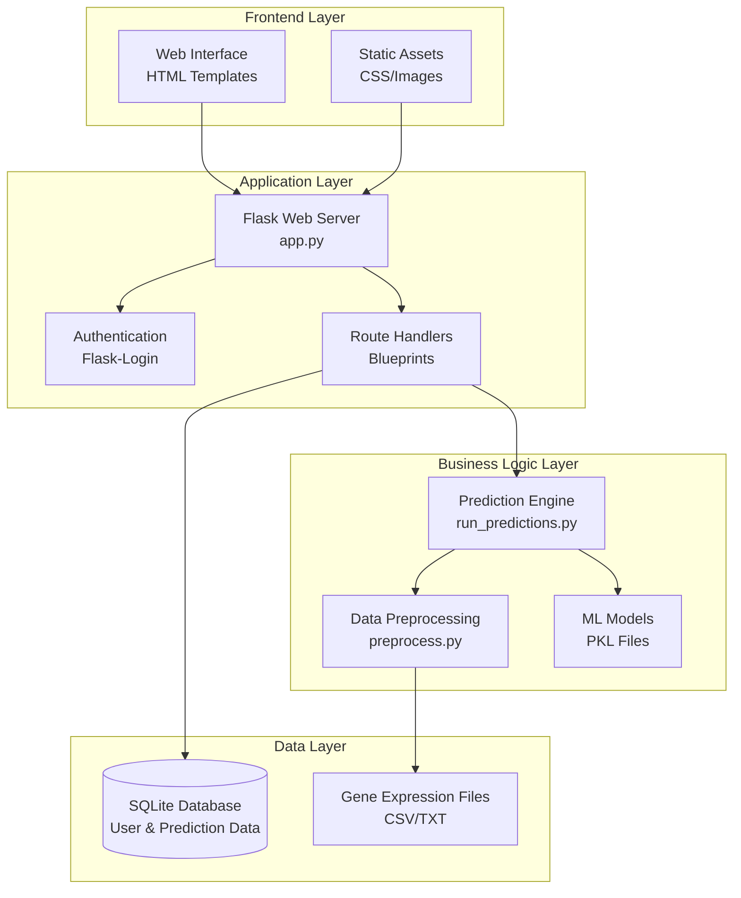
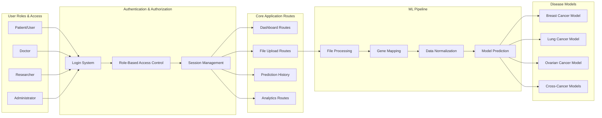
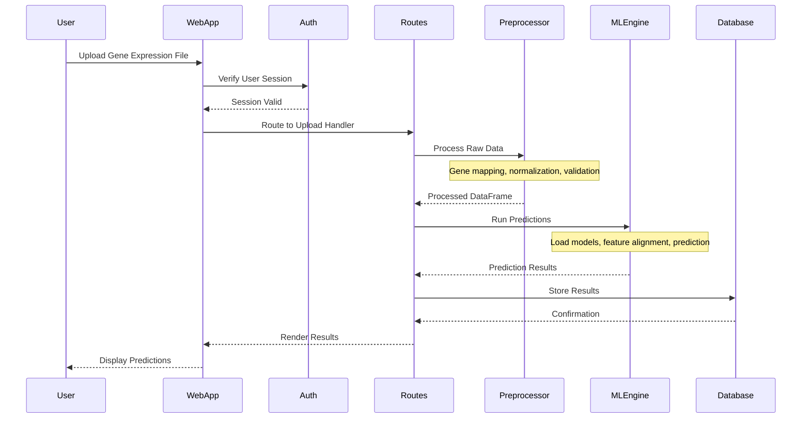
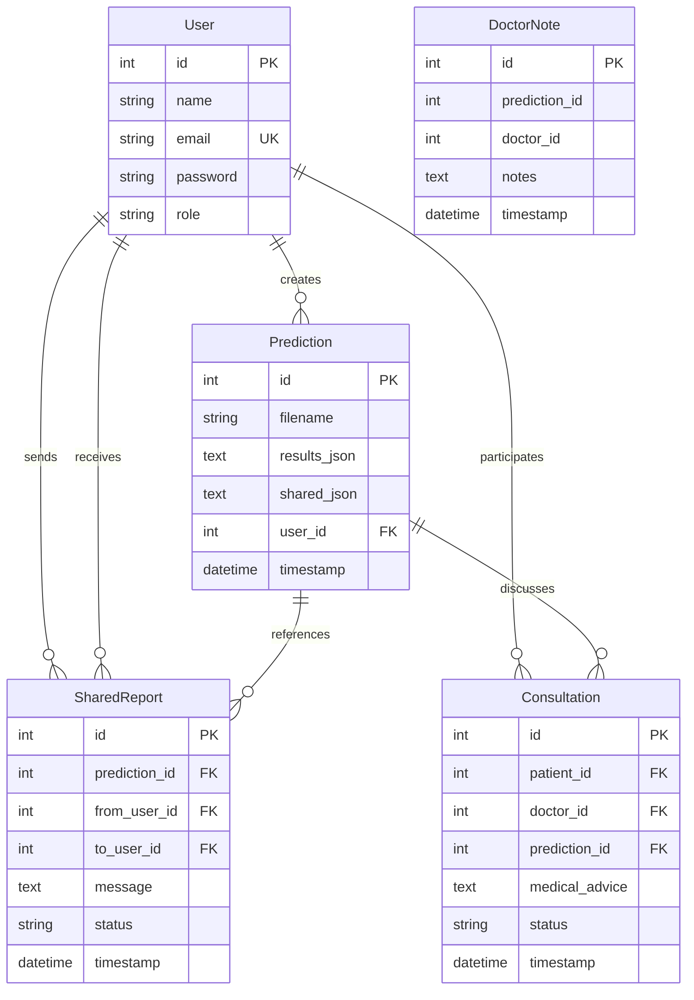
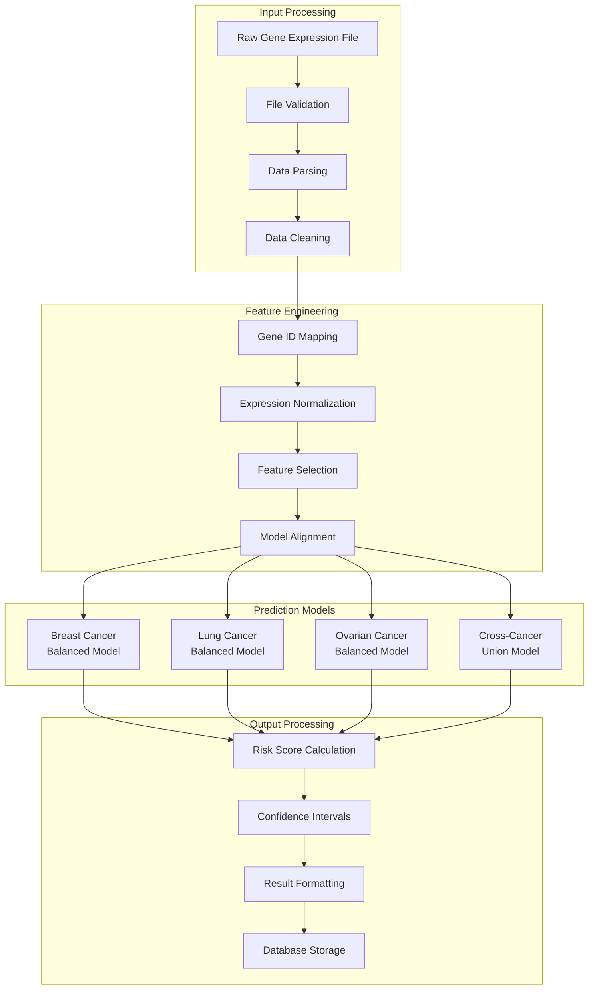
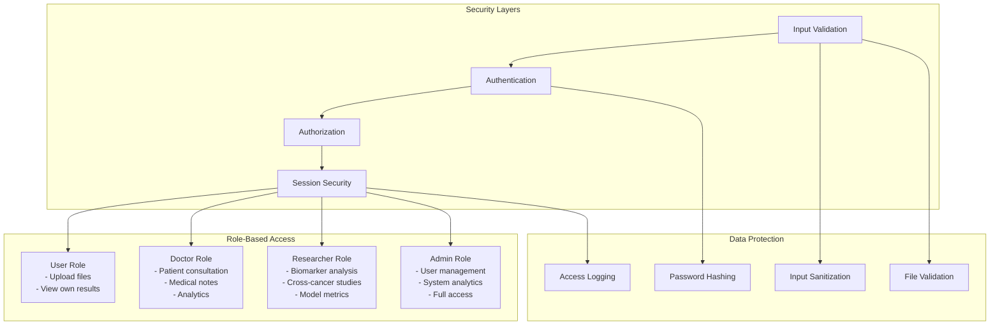
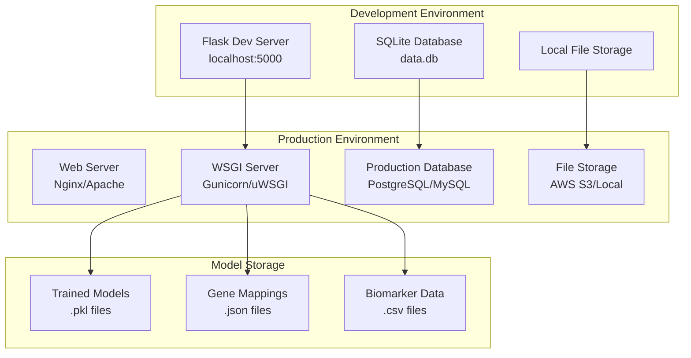

# GeneRisk AI - System Architecture Flowchart

## High-Level System Architecture

## Detailed Component Architecture

## Data Flow Architecture

## Database Schema Architecture

## ML Model Architecture

## Security & Access Control Architecture

## Deployment Architecture

## Key System Components

### 1. **Web Application Layer**
- Flask-based web server with role-based authentication
- Responsive HTML templates for different user roles
- RESTful API endpoints for file uploads and predictions

### 2. **Machine Learning Pipeline**
- Multi-cancer prediction models (Breast, Lung, Ovarian)
- Gene expression data preprocessing and normalization
- Cross-cancer analysis capabilities

### 3. **Data Management**
- SQLite database for user and prediction storage
- File handling for gene expression datasets
- Secure data validation and sanitization

### 4. **User Management**
- Role-based access control (Patient, Doctor, Researcher, Admin)
- Secure authentication with password hashing
- Session management and authorization

### 5. **Analytics & Reporting**
- Prediction history tracking
- Performance metrics and model evaluation
- Collaborative features for medical consultation

This architecture supports scalable, secure, and maintainable cancer risk prediction with clear separation of concerns and role-based functionality.